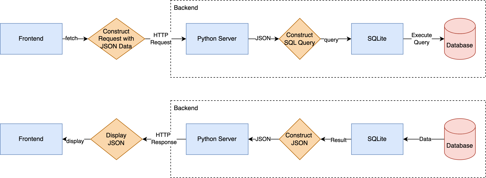

# Why SQLite?

# What is SQL (Structured Query Language)?
A query language used to interact with relational databases (think tables).
Play with SQL: https://www.mycompiler.io/new/sql

# What are relational databases?
- Imagine a database of multiple tables
- Each table with multiple rows and columns 
- Each column has a fixed data type
- Tables can be related to one another through the use of keys

# SQLite
- With python, one way to deal with databases and running SQL queries on them is [SQLite3](https://docs.python.org/3/library/sqlite3.html)

## Workflow:
1. Create a connection `con = sqlite3.connect('<DatabaseName.db'>)`
2. Create a cursor `cur = con.cursor()`
3. Run queries `cur.execute('<query>')` or multiple queries `cur.executescript('<query>')`
4. Commit the changes `con.commit()`
5. Close the connection `con.close()`

## SQLInjection Attacks
- Execute queries like this:

`cur.execute("INSERT INTO students VALUES (?, ?, ?);", (id, username, sex))`

- Instead of this:

`cur.execute(f"INSERT INTO students VALUES ({id}, {username}, {sex});"`
Second one can lead to [SQLInjection](https://en.wikipedia.org/wiki/SQL_injection) attacks. See `sqlite_sql_injection_attacks.py`.

## CSV vs SQL Databases
- CSVs are stored as readable text files, SQL database files are written in a fast-indexing special data format in C.
- Reading and editing CSVs is slower than SQL DBs
- Concurrent writing is a problem in CSVs (race conditions)

## CSV to SQL DB:
- `csv_to_sqldb.py`

## Read SQL_DB in Pandas:
- `read_sql_with_pandas.py`