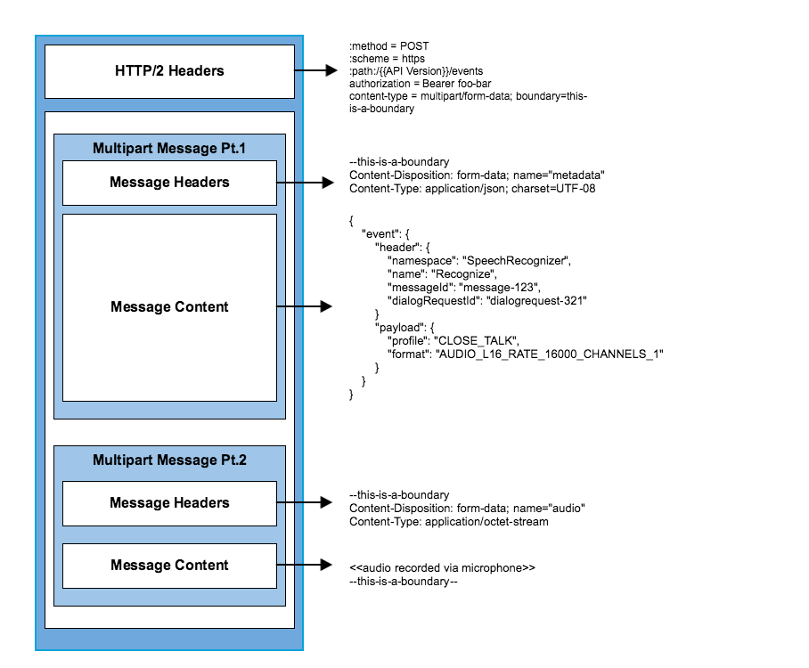

# RestAPI

## What happens when...
https://github.com/alex/what-happens-when

### You enter a URL into a web browser
1. The browser looks up the IP address for the domain name via DNS
2. The browser sends a HTTP request to the server
3. The server sends back a HTTP response
4. The browser begins rendering the HTML
5. The browser sends requests for additional objects embedded in HTML (images, css, JavaScript) and repeats steps 3-5.
6. Once the page is loaded, the browser sends further async requests as needed.

## Json
- JSON stands for JavaScript Object Notation
- JSON is often used when data is sent from a server to a web page
- JSON is "self-describing" and easy to understand
- Imagine python dictionaries 

## API -- Application Programming Interface
- Rules that you must follow to communicate with other software systems (possibly over the internet)
- API developers can design APIs using several different architectures. 
- APIs that follow the REST architectural style are called REST APIs.
- Web services that implement REST architecture are called RESTful web services. 

## REST -- Representational State Transfer
A certain set of rules on how an API should work.

REST defines the following architectural constraints:

- Stateless: The server won’t maintain any state between requests from the client.
- Client-server: The client and server must be decoupled from each other, allowing each to develop independently.
- Cacheable: The data retrieved from the server should be cacheable either by the client or by the server.
- Uniform interface: The server will provide a uniform interface for accessing resources without defining their representation.
- Layered system: The client may access the resources on the server indirectly through other layers such as a proxy or load balancer.
- Code on demand (optional): The server may transfer code to the client that it can run, such as JavaScript for a single-page application.

[Source](https://realpython.com/api-integration-in-python/)

Example: https://api.github.com/users/<username>

## Alternatives for REST:
- [SOAP](https://stoplight.io/api-types/soap-api)
- [GraphQL](https://graphql.org/)
- [RPC](https://en.wikipedia.org/wiki/Remote_procedure_call)

## Hypertext Transfer Protocol

[Source](https://developer.amazon.com/en-US/docs/alexa/alexa-voice-service/structure-http2-request.html)

You send HTTP Requests, you get back HTTP responses.

| Method    | Purpose   |
| -----     | -----     |
| GET       | Retrieve existing data |
| POST       | Add new data |
| PUT       | Update existing data |
| PATCH       | Partially update existing data |
| DELETE       | Delete data |

## HTTP Errors
| Status    | Message   |
| -----     | -----     |
| 404       | The URL you asked is not found |
| 503       | Unavailable right now |
| 403       | The server understands the request but refuses to authorize it |
| 200       | Everything went perfect |
| 400       | Something is wrong on the request params |
| anything else | anything |

Read more: https://www.restapitutorial.com/httpstatuscodes.html