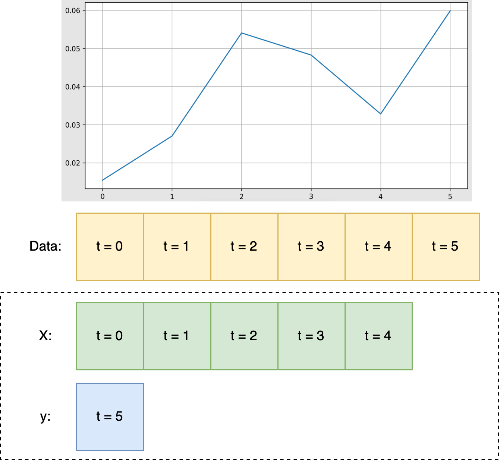
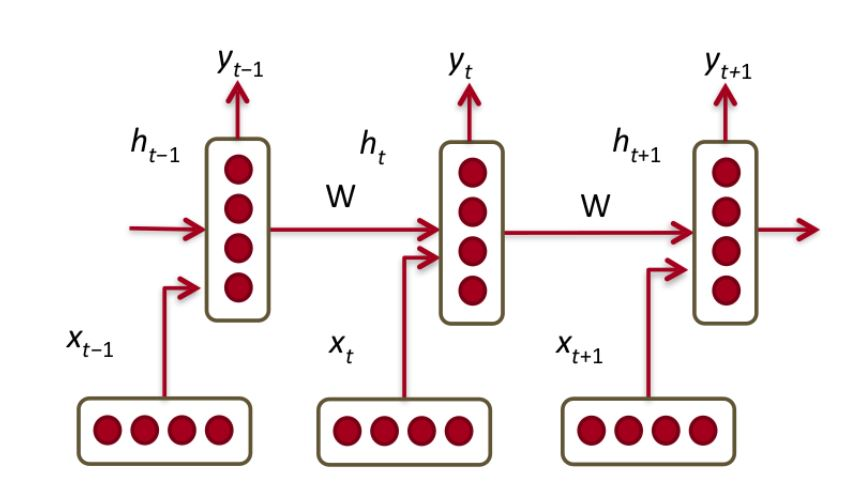

[[Colab Notebook]](https://colab.research.google.com/drive/1FtnGxF0koQUtkma2fl8FsMDkP7xeVycZ?usp=sharing)

# Time series data
Modeling a time series data:

#### Q: Can you think of some time series data?

# Recurrent Neural Network

Recurrent Neural Networks have loops, which when unrolled looks as follow:

## Backpropagation Through Time (BPTT)
The gradients at propagated from from t=T to t=0 in the above network where T is the sequence length.

## What is the shape of the input to RNN?
- NN: [batch_size x num_input_features]
- RNN: ??

# Units
Number of units is just #neurons on each layer of the RNN. Following is a RNN with x units... what is x?

# RNNs limitations:
- Gradient vanishing/explosion
- Computationally slow, to compute activations at time t, we need activations of time t-1, t-2..., can't do this in parallel.
