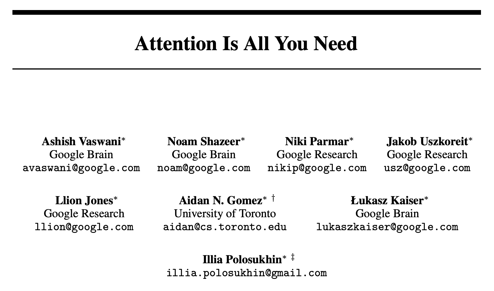

# Transformers
- RNNs don't work for long sequences because of gradient vanishing and explosion. 
- Both LSTMs and RNNs are recursive, that means they can't run parallelly on GPU, thus they are slow.
- Transformers are sequence models that work well for large sequences are computationally faster (parallelizable on GPU)... making them ideal for language. 

# Paper: Attention is all you need
Investment in research pays off with $$$$

# Breaking down the model:

1. Input Representation
2. Encoder
3. Decoder

# Huggingface Transformers

For all our experiments on transformers, we will be using the huggingface transformers library.

`pip install transformers`

# Input Representation
[Colab Notebook](https://colab.research.google.com/drive/1PQBVJRsg24U7AkCbtCB5k48MQyJ4ViPn?usp=sharing)

# Encoder
[Colab Notebook](https://colab.research.google.com/drive/1hCbNZp4La34ihGAgaVtIYNLJCuq8_WLo?usp=sharing)

## Use encoder only models for:
1. Sentence Classification
2. Token Classification
3. Clustering

# Decoder
[Colab Notebook](https://colab.research.google.com/drive/1O4Kr4cTzug6tMSFzzZe3AIHUCCAfrwBo?usp=sharing)

## Use decoder only models for:
1. Generating Text for:
    a. Continuations for a prompt
    b. Question Answering
    c. Chatbots

# Encoder Decoder Models

## Use encoder-decoder models for:
1. Translation
2. Style-rewriting: Formatl to informal

# Expanding Creativity with Transformers

# Some important concepts we have skipped:
- Self-Attention
- Masked Self-Attention
- Cross Attention
- GPU Parallelizability of transformers
- Decoding Algorithms:
    - Beam Search
    -  Nucleus (Top-p) Sampling
    - Top-k Sampling
